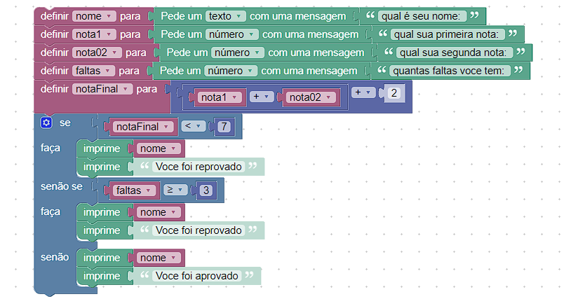

# Instruções do projeto:

## Desenvolva, utilizando o Google Blockly, um programa que utiliza o nome de um aluno, duas notas e a quantidade de faltas que ele teve. Conclua se o aluno está aprovado ou reprovado de acordo com as especificações:
 
Se a média do aluno for menor que sete, o sistema deve informar o nome do aluno e que ele está reprovado;
Se o aluno possuir mais de três faltas, o sistema deve informar o nome do aluno e que ele está reprovado;
Se a média do aluno for maior ou igual a sete, o sistema deve informar o nome do aluno e que ele está aprovado.

No sistema, todos os valores devem estar armazenados em variáveis.

Realize essa atividade, suba esse arquivo em um drive com link público e compartilhe o link no campo ao lado para que outros desenvolvedores possam analisá-lo.

## Resolução:



- Para acessar: https://blockly-demo.appspot.com/static/demos/code/index.html?lang=pt-br#8if6q5


## Código:


```
var nome, nota1, nota02, faltas, notaFinal;


nome = window.prompt('qual é seu nome: ');
nota1 = Number(window.prompt('qual sua primeira nota: '));
nota02 = Number(window.prompt('qual sua segunda nota: '));
faltas = Number(window.prompt('quantas faltas voce tem: '));
notaFinal = nota1 + nota02 + 2;
if (notaFinal < 7) {
  window.alert(nome);
  window.alert('Voce foi reprovado');
} else if (faltas >= 3) {
  window.alert(nome);
  window.alert('Voce foi reprovado');
} else {
  window.alert(nome);
  window.alert('Voce foi aprovado');


```
